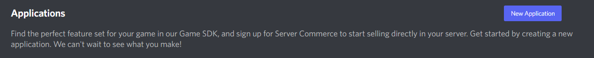
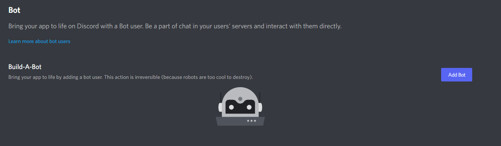

# Manage Invites
Right now this is a simple bot with one command to manage your servers invites!

# Requirements
- [Python 3.10+](https://www.python.org/downloads/)
    - [discord.py module](https://pypi.org/project/discord.py/)
        > Requires Version 2.1+
    - [dotenv module](https://pypi.org/project/python-dotenv/)

# Usage
`/pause-invites state`

`state` takes either on or off depeding on wether you want invites to be paused or not
    
    on: Invites are paused
    off: Invires are open like normal

Before running, make sure to create a file called `.env`.
> Make sure to create it in the same directory as `main.py`

Inside the `.env` file, type `TOKEN:<YOUR TOKEN WILL GO HERE>`

# How to Get A Bot's Token
- Go to [here](https://discord.com/developers/applications)
- Click on the button labeld "**New Application**" 

    

- Enter a Name, check the box the disclaimer box, and click "**Create**" 

    

- Navigate to the tab labbled "**Bot**" on the side 

    

- Click on "**Add Bot**" in the top left, then in the modal "**Yes, do it!**"

    
    

- Click on "**Reset Token**" then "**Yes, do it!**"
    > *Note: If you have 2fa on you will have to enter your 2fa code*
    
    > ## Make sure to **NOT** share this token with **anyone**

    

- In the `.env` file, paste this after `TOKEN=`

If all goes corectly, you are all done and can now run your bot by running the `main.py` file!

# Questions, Comments, or Suggestions?
You can contect me via direct message on discord -> `Woofer21#0220`!
